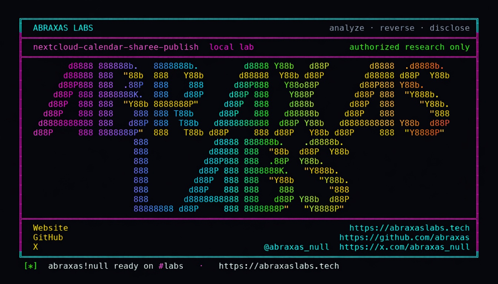

<p align="center">
  
</p>

<p align="center">
  <a href="https://abraxaslabs.tech"><strong>abraxaslabs.tech</strong></a>
  &nbsp;·&nbsp;
  <a href="https://github.com/abraxas">github.com/abraxas</a>
  &nbsp;·&nbsp;
  <a href="https://x.com/abraxas_null">@abraxas_null</a>
  &nbsp;·&nbsp;
  <a href="https://github.com/abraxas/nextcloud-calendar-sharee-publish">nextcloud-calendar-sharee-publish</a>
</p>

# nextcloud-calendar-sharee-publish

**Nextcloud Server** `35.0.0` - Nextcloud GmbH

Unpublished Nextcloud source finding: CalDAV `PublishPlugin` only checks `{DAV:}write`. Owner-limit `limitAddressBookAndCalendarSharingToOwner` defaults to `no`. A colleague you gave **edit** on a calendar can publish it. Anyone with the secret URL reads your non-PRIVATE events with no login.

**A bad actor with edit on your calendar can turn it into a public URL. Anyone who has that URL can read your meetings and attendees without logging in.**

| | |
|---|---|
| ID | Unpublished Nextcloud source finding #4 (no CVE yet) |
| CWE | [CWE-284, CWE-862](https://cwe.mitre.org/data/definitions/284.html) |
| CVSS | **High: 6.5** `CVSS:3.1/AV:N/AC:L/PR:L/UI:N/S:U/C:H/I:N/A:N` |
| Product | [Nextcloud Server](https://github.com/nextcloud/server) |
| Affected | **35.0.0** (`da02f41`) official `nextcloud:35.0.0-apache` |
| Patched | vendor patch - see references |
| Auth | write-sharee, then unauthenticated public read |
| License | [GNU Affero GPL v3.0](LICENSE) |
| Lab | `127.0.0.1` only |

---

## What an attacker can do

You share a calendar with a colleague as **can edit**. That colleague posts `publish-calendar`. Nextcloud mints a public calendar URL.

Then:

- **Anyone with the URL** (no login) can **read your events**
- They see **titles, times, attendees** (non-`PRIVATE` objects)
- They cannot become you, and they cannot publish an address book this way
- A **view-only** sharee cannot do this; **edit** is enough

Reshare of the calendar is forbidden. Publish is not. The owner-limit config exists and is **off** by default.

---

## Advisory (from the source map)

`PublishPlugin.php` 191-207: `{DAV:}write` then `limitAddressBookAndCalendarSharingToOwner` default `no`. `Calendar.php` forbids reshare when `isShared()`; write ACL still grants `{DAV:}write` to edit-sharees. `CalDavBackend::setPublishStatus` inserts `ACCESS_PUBLIC`.

---

## Reproduction (authorized lab)

```bash
cd lab
./run.sh
```

Target **only** `http://127.0.0.1:18344`.

Success last line:

```text
SUCCESS NEXTCLOUD-CAL-SHAREE-PUBLISH who=write-sharee unauth-read=yes NEXTCLOUD-CAL-SHAREE-PUBLISH-WITNESS
```

---

## Lab images

- [`lab/docker-compose.yml`](lab/docker-compose.yml)
- [`lab/Dockerfile`](lab/Dockerfile)
- [`lab/run.sh`](lab/run.sh)

Publish nothing except `127.0.0.1`.

---

## References

- [github.com/nextcloud/server](https://github.com/nextcloud/server) tag [v35.0.0](https://github.com/nextcloud/server/releases/tag/v35.0.0)
- Vendor intake: [hackerone.com/nextcloud](https://hackerone.com/nextcloud). Do **not** open a public GitHub issue.
- Abraxas Labs: [abraxaslabs.tech](https://abraxaslabs.tech) · [github.com/abraxas](https://github.com/abraxas) · [@abraxas_null](https://x.com/abraxas_null)

---

## License

GNU Affero GPL v3.0. See [LICENSE](LICENSE). Loopback lab only. No warranty.
